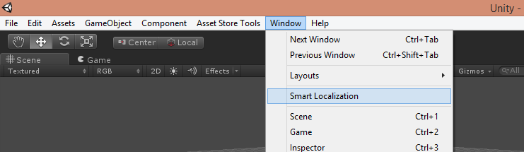
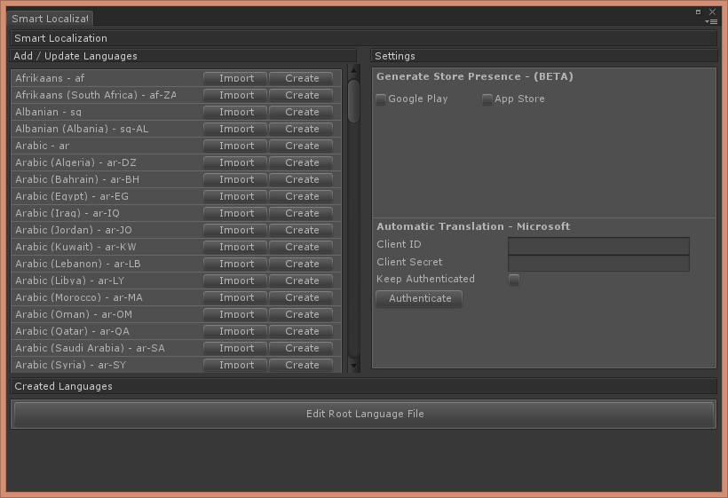
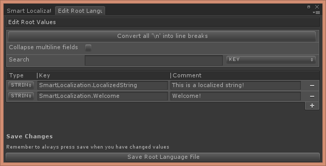
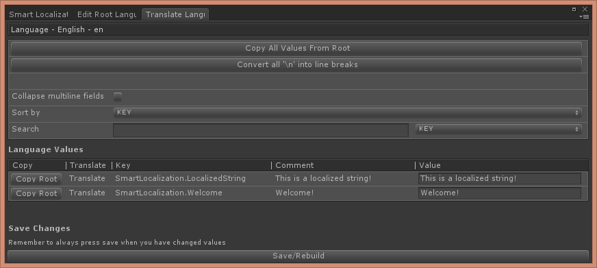
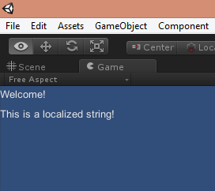
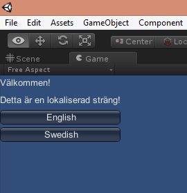

# Getting started with Smart Localization
Start by navigating to Window->Smart Localization.


The window will prompt you to create a Smart Localization workspace if you haven't done so already. Follow the instructions until you see the main localization window.

Press the Edit Root Language File button. This will bring up a new window where you create all the keys and root values along with the key types for your project. We'll start by adding two keys; SmartLocalization.Welcome and SmartLocalization.LocalizedString.

Once you've done that, press save and return to the main localization window.
Now it's time to create some languages. For the purpose of this tutorial, we'll create two languages; English and Swedish. Find the two cultures in the Add/Update Languages scroll list and press Create on each one.


Now press the 'Translate' button placed on the English culture row. A new window will be brought up. Since we wrote our root values in english, all we have to do here is to press the "Copy All Values From Root" – button. Don't forget to press save and return to the main window.

Now do the same procedure with Swedish. Press Translate and write the Swedish values in the 'Value' column. If you don't know Swedish, just copy what it says in the image below or write whatever value you want. Again, don't forget to press save when you are done.

That's basically all the setup you need to get started. By now, you can open the scene LoadAllLanguages.unity that can be found in the Smart Localization package from the store and you should see the created values in the scene when you press play.

Next I'll show a basic and easy way to get the localized values from code. I'll start by creating a new script called SmartLocTutorial.cs. In the script we'll load the english language and print the two localized strings we created earlier.
```csharp
using UnityEngine;
using System.Collections;
using SmartLocalization;

public class SmartLocTutorial : MonoBehaviour
{
    string welcomeMessage;
    string localizedString;

    void Start(){
        LanguageManager languageManager = LanguageManager.Instance;
        languageManager.OnChangeLanguage += OnChangeLanguage;
        languageManager.ChangeLanguage("en");
    }

    void OnDestroy(){
        if(LanguageManager.HasInstance){
            LanguageManager.Instance.OnChangeLanguage -= OnChangeLanguage;
        }
    }

    void OnChangeLanguage(LanguageManager languageManager){
        welcomeMessage = languageManager.GetTextValue("SmartLocalization.Welcome");
        localizedString = languageManager.GetTextValue("SmartLocalization.LocalizedString");
    }

    void OnGUI(){
        GUILayout.Label(welcomeMessage);
        GUILayout.Label(localizedString);
    }
}

```
Adding this script to an empty game object in your scene should produce the following output.


What if you want to switch to the swedish values at runtime? Simplest way to do that would be to expand the OnGUI method in our SmartLocTutorial script.
```csharp
void OnGUI(){
    GUILayout.Label(welcomeMessage);
    GUILayout.Label(localizedString);

    if(GUILayout.Button("English")){
        LanguageManager.Instance.ChangeLanguage("en");
    }

    if(GUILayout.Button("Swedish")){
        LanguageManager.Instance.ChangeLanguage("sv");
    }
}
```
Play your scene again, press the Swedish button, and you should see the Swedish values on the screen.

