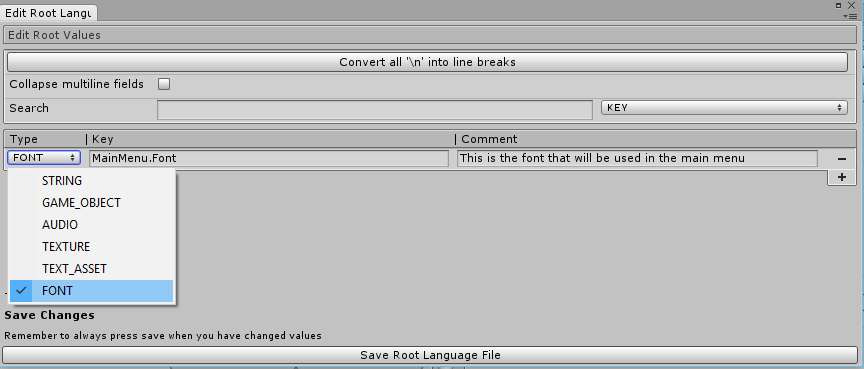
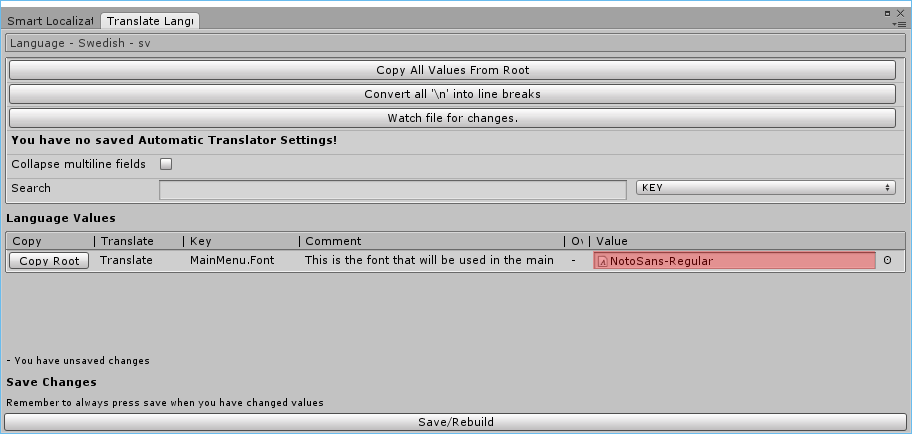

# How to localize fonts in Smart Localization
To start localizing fonts in Smart Localization, you first need to create a key with a FONT type in the root language file. Don't forget to press save after you've made your changes.


After this, you need to set the fonts in your localized languages. You can accomplish this by enterting the Translation Window of the desired language. In this tutorial, I will add the Google Noto Sans font to Swedish.

To get the font from code, you can use the GetFont() method in the LanguageManager.

```csharp
void MyFontRetrievalMethod()
{
    var myMainMenuFont = LanguageManager.Instance.GetFont("MainMenu.Font");
}
```