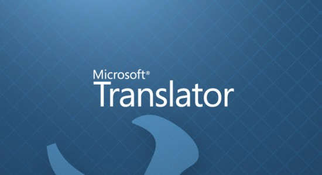
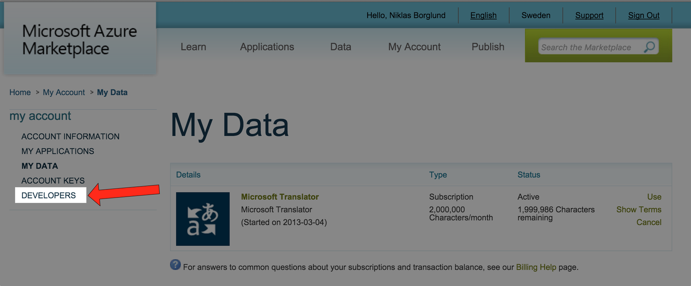
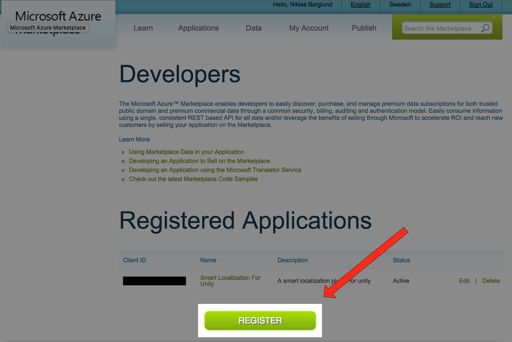
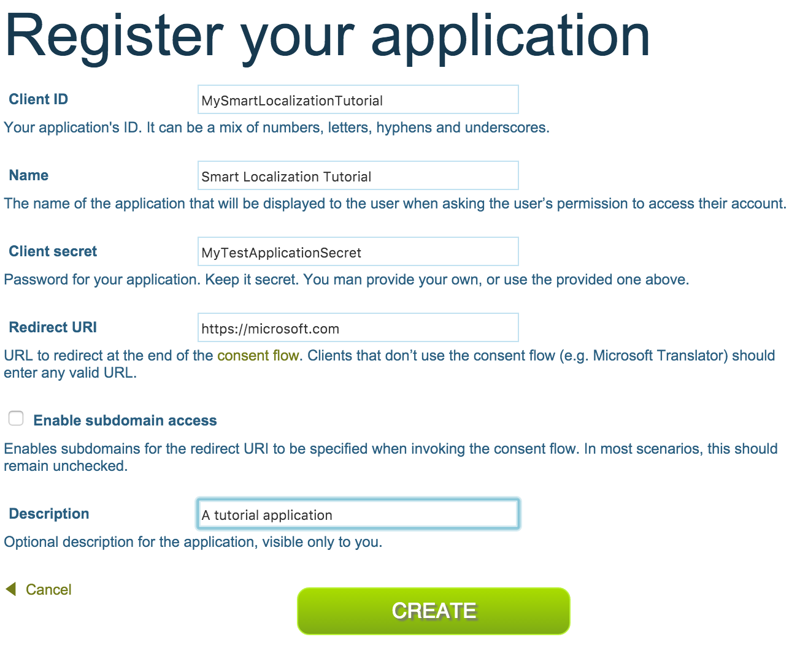
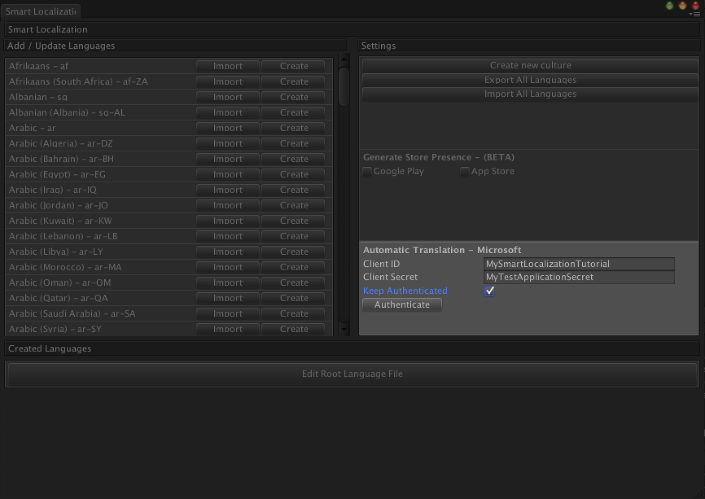
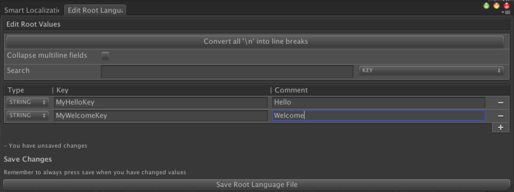
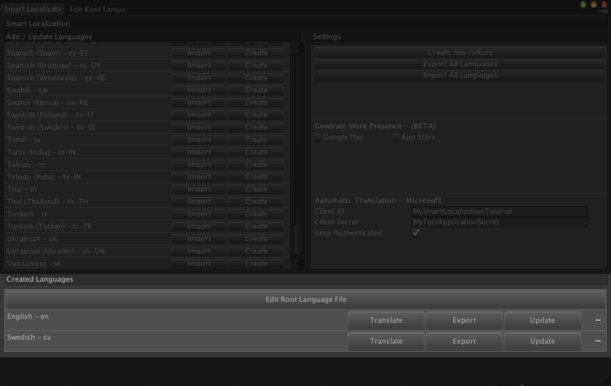
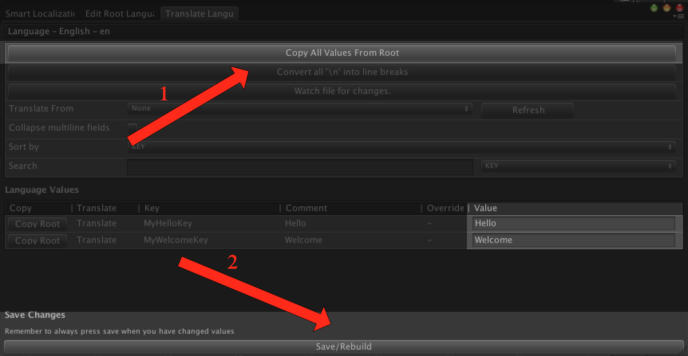
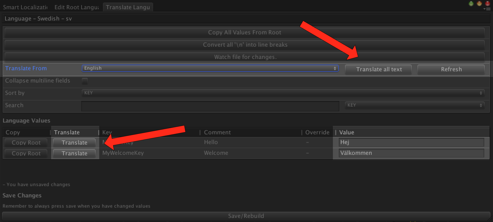

# How to use Microsoft Translator with Smart Localization

The ability to automatically translate your text content in Smart Localization is one of our most popular features. It quickly provides placeholder text into your game so that you can continue to customize your game to a specific language, without the immediate need of a professional translator.
The Microsoft Translator API also offers 2 million characters per month for free which makes it perfect for our purposes.

This guide will presumes that you have done the following already

* Created a Microsoft Azure Marketplace account - https://datamarket.azure.com/home
* Signed up to use the free tier of the Microsoft Translator API - www.aka.ms/TranslatorADM

## Creating a Microsoft Translator Application
With this setup, we need to create a new app in the marketplace in order to be able to use it within Smart Localization. Go to the Azure Marketplace and make sure you are signed in.

At their main page, you should see a button that says "My Account". Click that, and you should be redirected to your account page. When you are there - click the developer button.

This will take you to the developer site of Azure where you can find a button to register a new application. Press the register button.

his should let you create a new application. Fill in correct values of the fields by following the instructions.

Press create and voila! Your microsoft app is created.

## Using the Microsoft Translator App in Unity

For this tutorial, I'll use a completely new Smart Localization project. Navigate to the main project window by clicking Window->Smart Localization.

We'll add our newly created application credentials in the section that says "Automatic Translation - Microsoft". Press the Authenticate button when you are done.

Now we are ready to start translating. We'll begin by creating a couple of new keys in the root language file. Press the "Edit Root Language File" window.

Here, I'll just create two keys. One that says "Hello" and one that says "Welcome".

Now, go back to the main Smart Localization Window. It's time to create the languages that we'll automatically translate between. For this, I'll create English and Swedish.

Since our root language file values already are written in english, we can just use these values for our english translation. Press the translate button on the English row to enter the Translate Window.

When you are in this window. Press the "Copy All Values From Root" button and then save. 

Now you can head back to the main Smart Localization window and press the Translate button for Swedish.

You should now see a dropdown with the available languages to translate from if they are compatible with Microsoft Translator. Choose English from the dropdown menu. 

From here, you can either choose to press the "Translate All Text" button - or you can press the "Translate" button next to each individual key. It might take a few seconds before the translation returns from the Microsoft API, but within short the translated keys should appear in the Value column of the translate view. Don't forget to press save.

