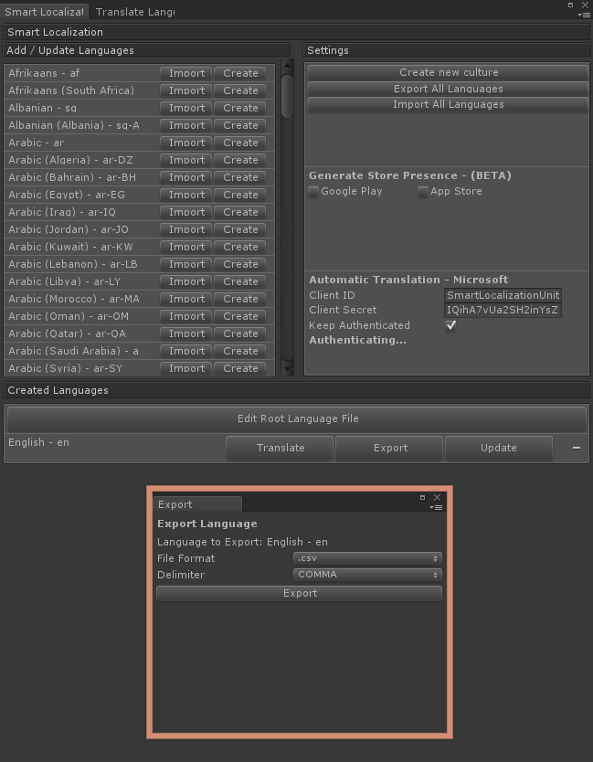
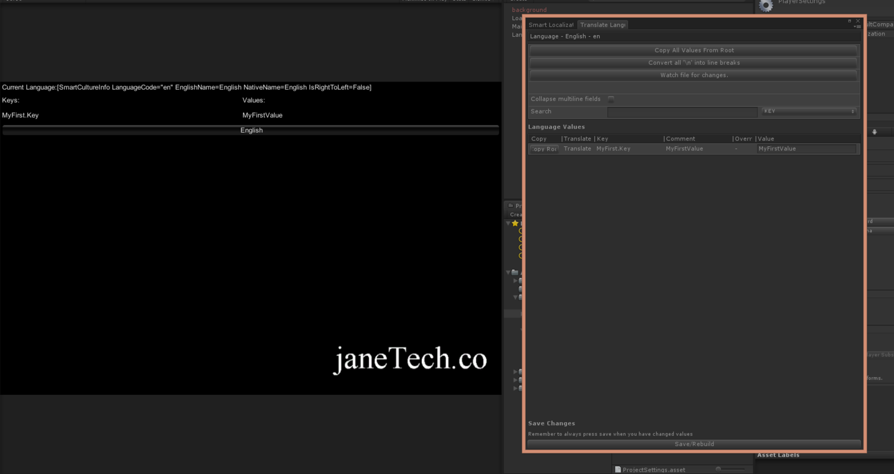
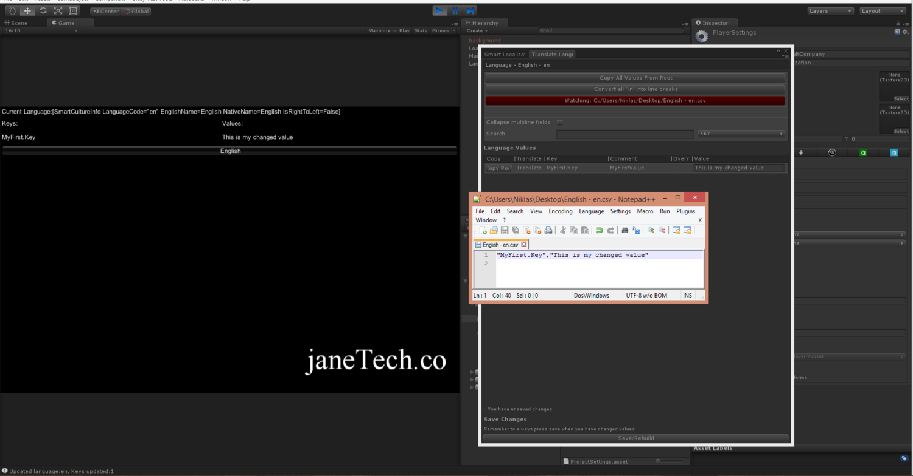

# How to use the Watch File Feature
Smart Localization PRO comes with a watch-file feature. This means that you can edit your .csv files in any csv compatible editor you'd like, and the game will instantly pick up your changes. This short tutorial will show you how to use it.

First off, you'll need to create a csv file that corresponds with your translated language. Open up the main Smart Localization window and press export. Save your file at a location of your choice. 

After you've done this, navigate to a scene that uses the Smart Localization in your UnityProject and press play. I'll use the LoadAllLanguages.unity scene that comes with the unitypackage.

Once the scene is started, open up the translation window for the selected language and press "watch file for changes". Navigate to your exported .csv file and select it using the popup that was brought up when you clicked the button.

Finally, open up the file you've selected to be watched in a csv editor of your choice. I'll use notepad++ for this tutorial.

Now when you change and save the values in the watched file, it will be instantly reflected in your game!

