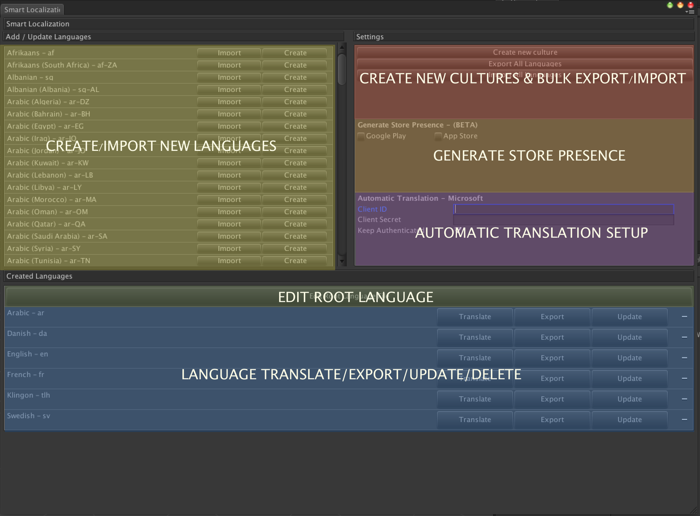

# The Main Project Window

The main project window in Smart Localization is the main navigation hub of our plugin. You can find this window by navigating in your Unity Editor to Window -> Smart Localization.

This is where you:

* Create new languages to translate
* Export/Update to and from .csv
* Navigate to the edit root window
* Navigate to the translate language window
* Setup your Automatic Translator Account with Microsoft Translator
* Generate a store presence for App Store & Google Play
* Create any type of new culture that you want to support. Even made up ones! 
* Export/Update to and from .xls 
* Export/Update all languages to and from a single csv/xls file

The picture below shows where you can find the different features and areas.
