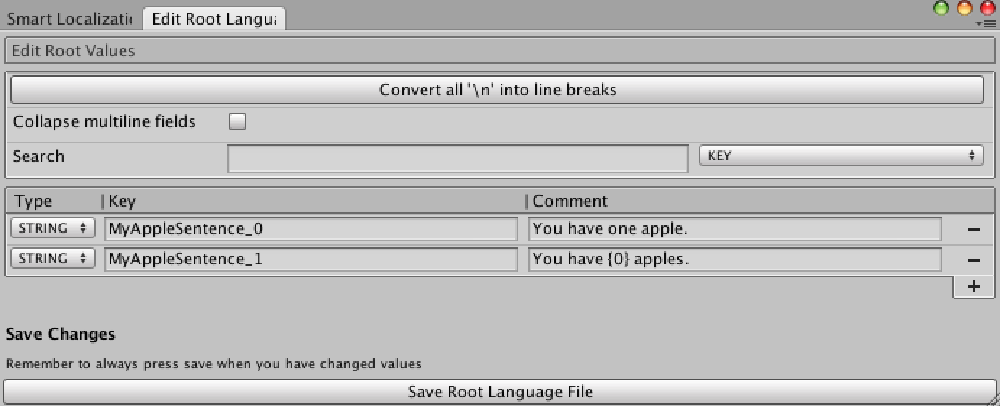

# Using the plural form feature
The plural support feature is used to handle strings with different numbers in them. For example: — “I have {0} apples”

This key works fine for when you have zero or more than one apples but becomes “I have 1 apples” if you have exactly one. The string you want in that case is “I have 1 apple” and that is what plural support is trying to solve.

## Naming your keys

For the plural form system to pick the correct plural form the keys have to be named in a special way: “[yourKeyName][pluralForm]” ex. “MyAppleSentence3” for plural form 3


This results in the plural form functions correctly picking the right plural form.

## Feature Details

We do this by extending the functions that you use to get strings today. If you add a number after your call to GetTextValue(key) so it becomes GetTextValue(key, count) we figure out what plural form that corresponds to in the currently selected language. We then map your key to that plural form by appending an underscore “” and the number of the plural form. The key “MyAppleSentence” then becomes “MyAppleSentene0” for the first plural form.

Its important to note that plural from number does not correspond directly to the number passed in to the GetTextValue function. “I have 2 apples” resolves to the second plural form for english but so does every call that requests the key with a number over 1. This is because English has two plural forms and the rule for them goes like this:

* plural from 0 for n=1
* plural form 1 for n=0 or n>1

To get this in perspective we can look at the Arabic plural form which goes like this:

* plural form 0 for n=0
* plural form 1 for n=1
* plural form 2 for n=2
* plural form 3 for n%100 >= 3 && n%100 <= data-preserve-html-node="true" 10
* plural form 4 for n%100 >= 11
* plural form 5 for everything else

## Using the plural system
When you have created the keys for your different plural forms all you have to do to use them is to add another parameter to the functions you usually use when getting strings from keys.

And plural forms of course works not just on string values but on any of the localized keys in your game.

Here is a list of the function signatures for the basic plural functions:

```csharp
string GetTextValue(string key, int count);
TextAsset GetTextAsset(string key, int count);
AudioClip GetAudioClip(string key, int count);
GameObject GetPrefab(string key, int count);
Texture GetTexture(string key, int count);
```

### Caveat
If you have a key that uses plural forms and you support languages with different number of plural forms there will be some empty keys in the languages with less forms.

This is needed because of the root keys system and also because of bulk export to single csv/xls to have rows match even in languages which doesn’t have a use for that many plural forms.

### Defining your own plural function
In addition to providing the plural functions for each supported language we also expose an overloaded function for getting a key and defining your own plural rule.
```csharp
string GetTextValue(string key, int count, Func<int, int> pluralForm);
TextAsset GetTextAsset(string key, int count, Func<int, int> pluralForm);
AudioClip GetAudioClip(string key, int count, Func<int, int> pluralForm);
GameObject GetPrefab(string key, int count, Func<int, int> pluralForm);
Texture GetTexture(string key, int count, Func<int, int> pluralForm);
```
These are great to have if you want to define an arbitrary rule for a specific key. Take these keys for example:
```csharp
“Unread_0” = “No unread messages”
“Unread_1” = “One unread message”
“Unread_2” = “{0} unread messages”
“Unread_3” = “Over one hundred unread messages”
```
To get these to work correctly you will have to define your own plural rule since it doesn’t correspond to any language defined plural rule.
```csharp
string messages = languageManager.GetTextValue(“Unread”, unreadMessages, (n) => n==0 ? 0 : n==1 ? 1 : n>100 ? 3 : 2);
```
Or you can store the plural rule for later use
```csharp
Func<int, int> customRule = (n) => n==0 ? 0 : n==1 ? 1 : n>100 ? 3 : 2;
string messages = languageManager.GetTextValue(“Unread”, unreadMessages, customRule);
```
If you want more details about handling plural forms in localization you can go to this link: http://localization-guide.readthedocs.org/en/latest/l10n/pluralforms.html