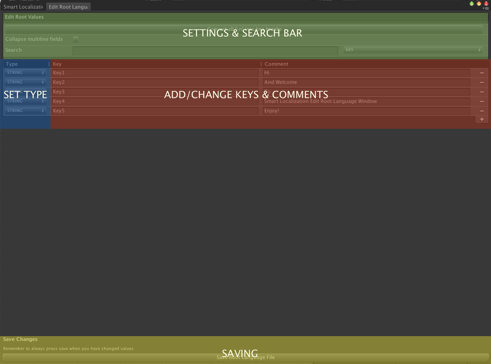

# The Edit Root Language Window

The Edit Root Language Window is where you add and change all your keys in your project. It manipulates something called the "root language file".

You could say that the root language file is the law book of all the other translation files. Everything in this file is law, and all other languages and translation need to abide by their rules. It's the very heart of the Smart Localization plugin.

In this window you can:

Add new keys
* Change existing keys
* Set what specific type each key is. e.g. If you want to localize audio, prefabs, textures or fonts other than just text.
* Search for a specific key

If you change a key here, all the other language files will be instantly changed as well to reflect the new changes.

