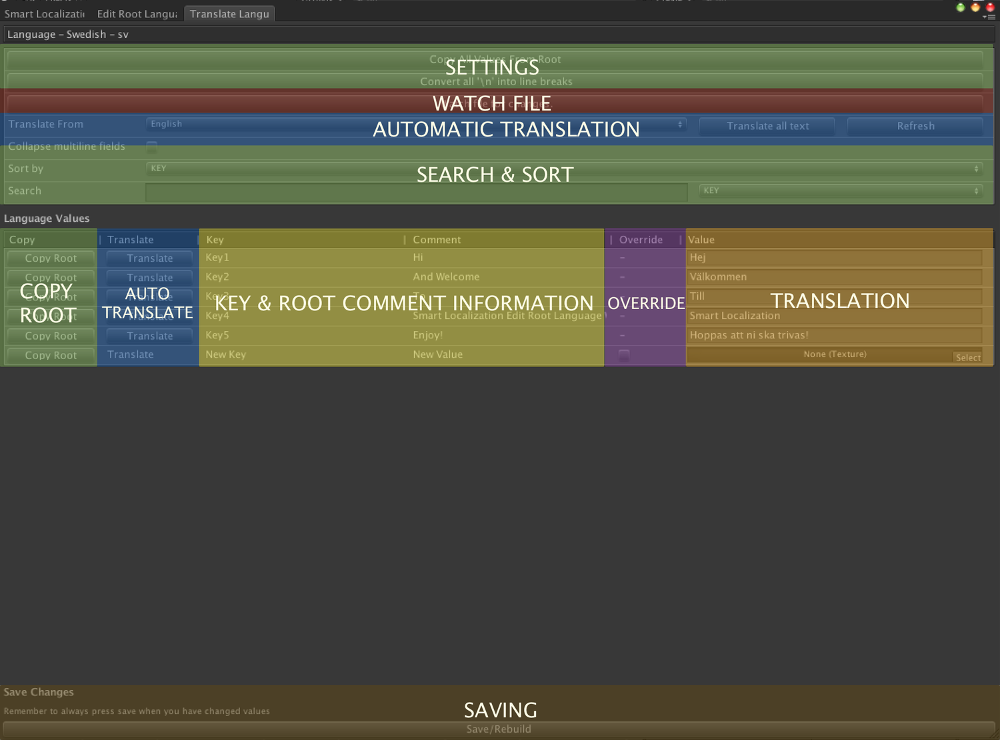

# The Translate Window

The translate window is where you add the translations to your game. Whether it's text or an asset - it all goes in here.

The translate window enables you to do the following:

* Translate text values into the desired languages
* Translate TextAssets, AudioClips, Textures & Prefabs
* Translate fonts to choose the correct font with the supported glyphs
* Automatically translate your text values with Microsoft Translator to another language
* Search & Sort Translations
* Override Asset Translations and use the same asset as another language.
* Copy values from the root language file
* Watch .csv or .xls file for changes and hot reload 

